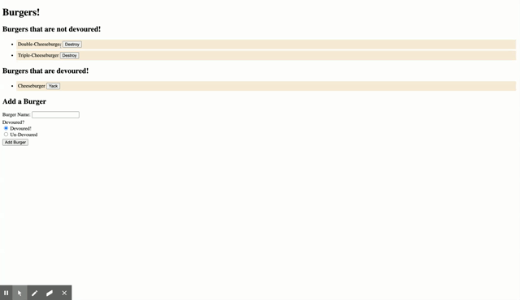

# burger

## Main project goal

- The main goal of this app is to create a burger logger with MySQL, Node, Express, Handlebars and a homemade ORM (yum!). The MVC design pattern was strictly followed. Node and MySQL were used to query and route data in the app, while Handlebars were used to dynamically generate HTML.

### Installation

## Instructions to run the application locally:

- Run..

```
npm install
```

- ..then run

```
npm start
```

## ..or view the hosted application live:

- [Here!](https://agile-crag-02741.herokuapp.com/)

## Functionality

- There are 3 x burgers out of the box
- Users may add burgers they have devoured or have not yet devoured
- Users may choose to devour undevoured burgers, or yack out devoured burgers

## Roadmap

- Update the UI with a modern framework
- Add the ability to delete burgers
- Add the ability for users to log in and view their own data

**Screen capture demonstrating application functionality**



## Credits

- [mySQL](https://www.npmjs.com/package/mysql)

- [ClearDB](https://www.cleardb.com/)

- [Heroku](https://www.heroku.com/)

- [ExpressJS](https://expressjs.com/)

- [Express-Handlebars](https://www.npmjs.com/package/express-handlebars)
© 2021 Trilogy Education Services, a 2U, Inc. brand. All Rights Reserved.
